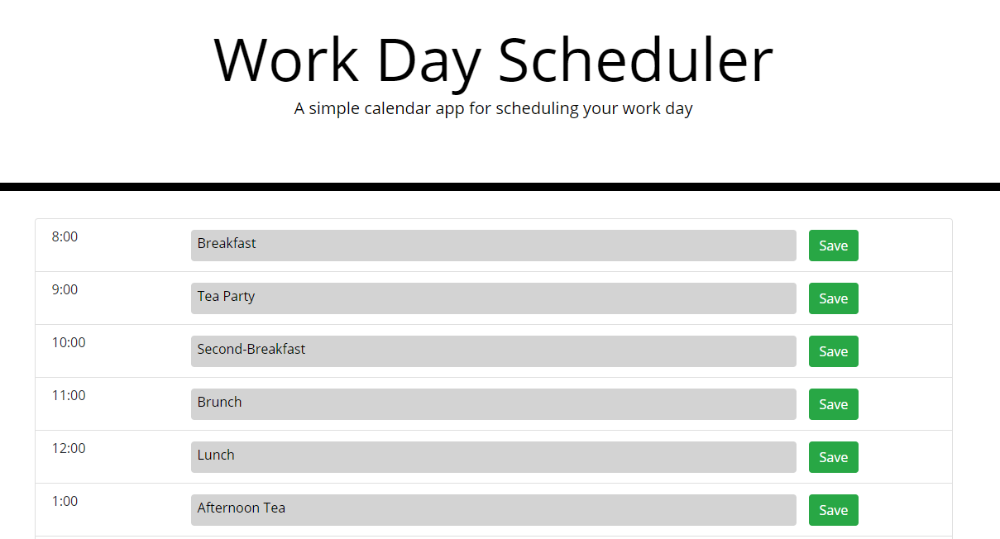

# Day-Planner

This project was desinged to build a day planner that can hold persistent data using local storage with the following parameters.

- The planner follows an 6:00 to 5:00 work schedule
- Allows direct user input and stores the text provided
- Save button to lock in text for a specific time node

